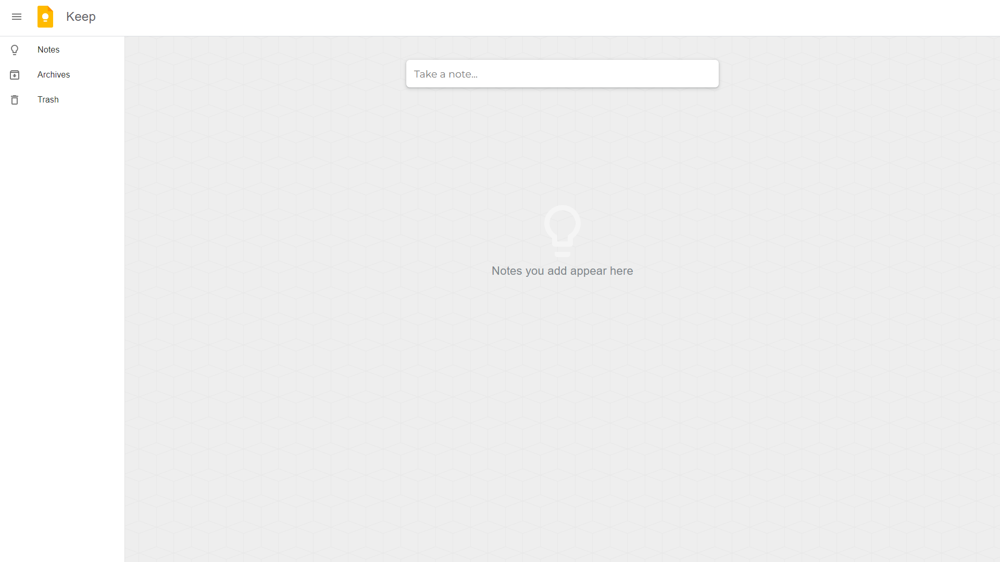
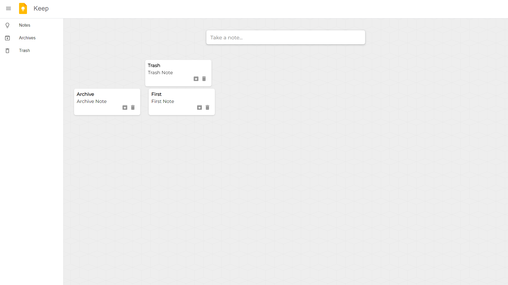

# React Note Taking App

This is a simple note-taking web application built using React for the frontend and Express.js for the backend.  The app fetches data from a backend server using Axios, which communicates with a RESTful API. Each note consists of a title and content. Users can easily manage their notes within the app's intuitive interface.

## Features

- Add new notes with a title and content.
- Delete existing notes.
- View a list of all notes.

## Backend API Endpoints

- GET `/notes`: Retrieve all notes.
- POST `/notes`: Add a new note.
- DELETE `/notes/:id`: Delete a note by its ID.

## Demo

